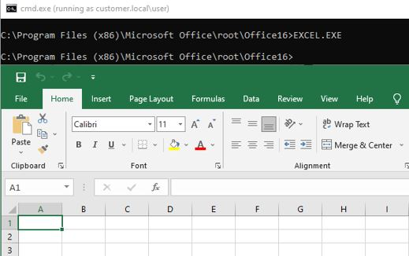

## Reconnaissance

This project is used to collect information from the local system and Active Directory via a Microsoft Excel macro. The macro is stored in one of the two text files included in this repo. Differences between the text file contents are minor and detailed below.

- Reconnaissance_Simple.vba – This file contains a macro that is configured to perform file creation and collection in a single step. Only four subroutines are exposed with the main one being the “A_Collect” subroutine.
- Reconnaissance_Granular.txt – This file contains a macro that is configured to allow the tester to selectively collect information from the target environment. Collecting individual elements from the environment (users, computers, groups) and omitting risky requests (domain trust enumeration) may be more stealthy.

### Usage

This functionality can be used in both new and existing Microsoft Office Excel workbooks.

#### New Document

- Use the Microsoft Excel View > Macros feature to create a new macro in the document. Use any name.
- Use the Ctrl+A key combination to select all text in the open macro editor.
- Copy the selected reconniassance macro content and paste it into the open window. 
- If performing cross-domain collection:
  - Set the IP address in the targetDC variable.
  - Run the T_SetTarget subroutine before running other macro functionality.
- Save the workbook as an XLSM document.
- Use the View > Macros feature to execute exposed macro functionality.

#### Existing Document (Reconnaissance_Granular.vba only)

- Make a backup copy of the document you are modifying.
- Review existing macro functionality to ensure that the new macro will not interfere with intended functionality.
- Use the Microsoft Excel View > Macros feature to add the macro subroutines to the exiting document.
- Copy the selected reconniassance macro features and paste it into the macro editor.
- Run the A1_BuildReconWorksheets subroutine. This will create new worksheets in the existing document.
- Run the F2_HideReconWorksheets subroutine. This will hide all of the newly created sheets so that users will not see them.
- Create or add logic to the Workbook_Open or primary macro subroutine in the original document to call the targeted reconnaissance features. Include a method to prevent automatic execution (this will prevent destruction of your collected data when you open the file). A good method is to check for existence of a bypass file like C:\bypass.txt and only execute the reconnaissance functionality when the file is NOT pesent.
- If performing cross-domain collection:
  - Set the IP address in the targetDC variable.
- Save the workbook.
- Monitor for document changes.

### Features and Sample Output

The reconnaissance macro collects and performs cursory analysis on local and Active Directory information gathered from a target environment. Details about common resources are collected (users, computers, groups) from the environment and conditional formatting is applied to highlight interesting results. The macro also includes subroutines for interactively querying user and group information from the environment. Sample output from the tool is shown below.

#### Local System and Process Enumeration


#### Local File System Enumeration


#### Active Directory Domain Configuration Details


#### Active Directory User Details


#### Sensitive Group Membership Details


### Macro Function Details

After successfully importing the macro into the Microsoft Excel workbook, the macro functionality can be executed. When the macro is executed, it will collect information from the local system and from Active Directory. In some cases, like group membership, execution can take a significant amount of time, especially in large Active Directory environments. Unless the macro throws an exception, you should let it continue to run. Eventually, the Excel process will return control to the user and the collected output can be analyzed.

#### Reconnaissance_Simple.vba

- A_Collect – Used for initial information gathering. This macro creates and formats the worksheets in the workbook, collects local information from the system where it is executed, collects LDAP information about numerous object types, and applies conditional formatting to highlight records of interest.
- B_QueryUser – Used to query details on an individual user. Navigate to the QueryUser worksheet, fill in the username, and execute the macro to gather metadata and group membership for the targeted user.
- C_QueryGroup – Used to query details on an individual group. Navigate to the QueryGroup worksheet, fill in the group name, and execute the macro to gather metadata and members for the given group.
- D_QueryLAPS - Used to check for readable LAPS passwords under the context of the executing user. This functionality cannot be integrated into the AD4_ADComputers because the ms-mcs-AdmPwd attribute may not exist.
- E_QuerySQL - Used to check for accessible Microsoft SQL Server instances under the context of the executing user. Microsoft SQL Server instances are gathered from the domain using the MSSQLSvc prefix on server SPNs.
- F_QueryGPO - Used to identify drive mappings, URL shortcuts, scripts, and unknown policy files in the SYSVOL/Policies share. Can provide quieter enumeration than direct SMB enumeration. This should look like a group policy refresh.
- G_HideReconWorksheets – Hides all of the worksheets included in the workbook. This was previously used for social engineering with the workbook, but may no longer be useful due to macro restrictions.
- H_UnideReconWorksheets – Unhides all of the worksheets included in the workbook. This was previously used for social engineering with the workbook, but may no longer be useful due to macro restrictions.
- T_SetTarget - Used to set the target domain controller when performing cross-domain enumeration or proxied execution. Set the IP address of the DC in the source of this subroutine before execution.

#### Reconnaissance_Granular.vba

- A1_BuildReconWorksheets – Used to create and format the worksheets in the workbook. The global variable targetDC is also set in this subroutine. If you are targeting as specific DC or are proxying Excel into an environment, set this variable accordingly. Otherwise, the macro will use context from the executing computer.
- A2_Collect – This subroutine is functionally equivalent to the A_Collect subroutine in the ADRecon-Simple.txt macro. This will collect from all sources and save the workbook. The A1_BuildReconWorksheets must be executed before running this macro.
- AD1_ADUsers – Collects user details from Active Directory. This subroutine populates two worksheets. The first contains detailed user information with several attribute values. The second contains an expanded analysis of the userAccountControl attribute. The attribute value is expanded and interpreted bitwise with an indication of the account configuration.
- AD2_ADInfo – Collects configuration information about Active Directory including the default domain password policy, defined fine-grained password policies, and the ms-DS-MachineAccountQuota value.
- AD3_ADGroups – Collects information about Active Directory groups. This subroutine populates two worksheets. The first contains generic group information with the first member of each group. The second contains member enumeration details for groups names containing keywords like “admin” and “vpn”.
- AD4_ADComputers – Collects information about Active Directory computer objects. The organization’s naming convention may be useful for identifying interesting services (jump hosts, application servers, etc) and other attributes can be useful in identifying dormant computer accounts, potential for Pre-Windows 2000 passwords, and other misconfigurations.
- AD5_DFSRoot – Collects share names for published Distributed File System (DFS) in Active Directory.
- AD6_TrustedDomains – Collects information on trust relationships that exist for the domain being interrogated. Trusts may identify additional opportunities to collect Active Directory information for foreign or child domains where bidirectional trusts are established.
- AD7_ADSites – Collects information about Active Directory sites associated with an environment. Site analysis may allow you to identify different locales associated with the organization and the subnets that belong to those locales.
- AD8_ADSubnets – Collects information about subnets defined in Active Directory. Subnet details may allow you to determine the specific purpose for a given network segment. The relationship to Active Directory sites may also provide additional context.
- F1_ApplyConditionalFormatting – Applies conditional formatting rules defined for the collection worksheets. Conditional formatting rules will highlight interesting process names, disabled users, interesting hostnames, and other details.
- F2_HideReconWorksheets – Hides all of the worksheets included in the workbook. This was previously used for social engineering with the workbook, but may no longer be useful due to macro restrictions.
- F3_UnhideReconWorksheets - Unhides all of the worksheets included in the workbook. This was previously used for social engineering with the workbook, but may no longer be useful due to macro restrictions.
- H1_HostInfo – Collects information about the host executing the macro including running processes, the Active Directory domain name, and domain controller.
- H2_UserInfo – Collects information about the user that executed the macro including common user attributes and group memberships.
- H3_ProgramFiles – Collects folder listings from the Program Files and Program Files (x86) directories. This is useful for identifying custom software and defensive products installed on the host.
- Q1_QueryUser – Used to query details on an individual user. Navigate to the QueryUser worksheet, fill in the username, and execute the macro to gather metadata and group membership for the targeted user.
- Q2_QueryGroup – Used to query details on an individual group. Navigate to the QueryGroup worksheet, fill in the group name, and execute the macro to gather metadata and members for the given group.
- Q3_QueryLAPS - Used to check for readable LAPS passwords under the context of the executing user. This functionality cannot be integrated into the AD4_ADComputers because the ms-mcs-AdmPwd attribute may not exist.
- Q4_QuerySQL - Used to check for accessible Microsoft SQL Server instances under the context of the executing user. Microsoft SQL Server instances are gathered from the domain using the MSSQLSvc prefix on server SPNs.
- Q5_QueryGPO - Used to identify drive mappings, URL shortcuts, scripts, and unknown policy files in the SYSVOL/Policies share. Can provide quieter enumeration than direct SMB enumeration. This should look like a group policy refresh.
- T_SetTarget - Used to set the target domain controller when performing cross-domain enumeration or proxied execution. Set the IP address of the DC in the source of this subroutine before execution.


### Proxied Execution

The macros identified above can be executed through a SOCKS proxy and implant. To do so, the targetDC variable must be set in the macro to target the IP address of the DC in the customer environment.


Next, a Proxification rule should be added for the “excel.exe” binary in Proxifier.


Next, the runas.exe command should be used to launch a command prompt with the “netonly” option under the context of the compromised user account.

```
runas.exe /netonly /u:[domain]\[user] cmd.exe
```


The resulting command prompt should then be used to launch Microsoft Excel on the proxied Microsoft Windows host.



Run the appropriate macro subroutine to collect information from the target environment. The output in the HostInfo and ProgramFiles worksheets will not be populated with useful information (just details from your local test system).
